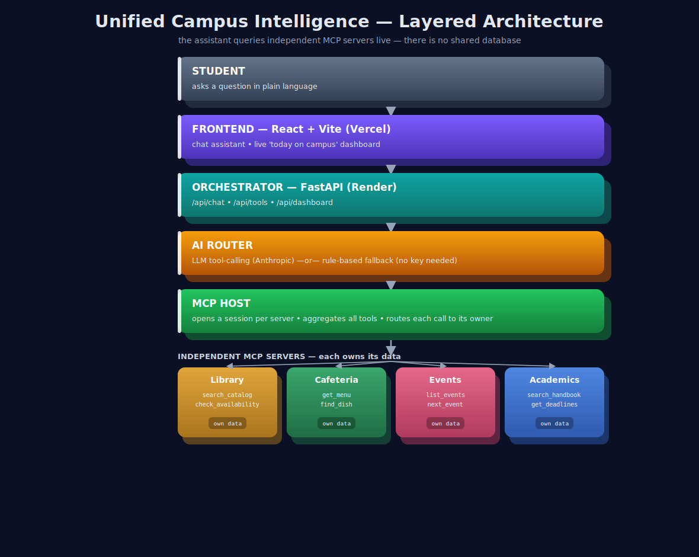
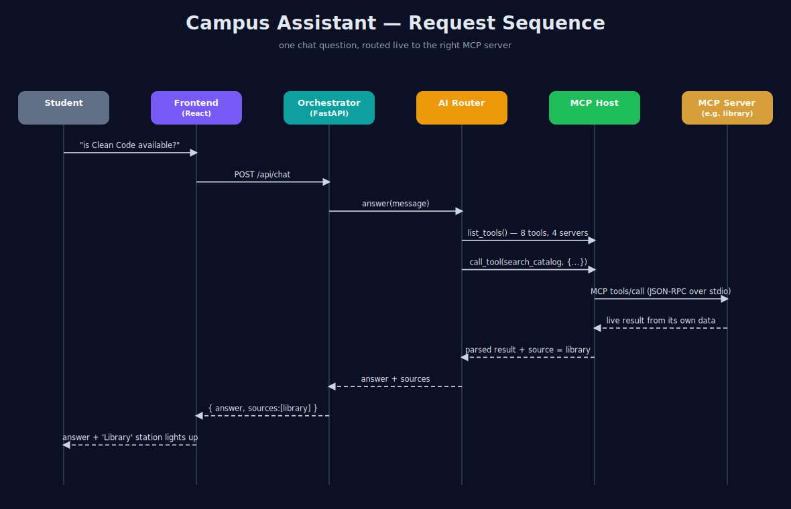

# Unified Campus Intelligence Dashboard

A single web app where a student asks one question — "Is *Clean Code* in the library?", "What's for lunch?", "When's the next robotics event?" — and gets an answer pulled **live** from the right campus system. It also shows a "today on campus" dashboard that brings the menu, events, deadlines and library status into one view.

Campus data is normally scattered: the library has its own portal, the menu is a PDF, events live on Google Calendar, rules sit in a huge handbook. This project does **not** scrape all of that into one big database. Instead, each source is wrapped in its own small **MCP server**, and the AI assistant decides which server(s) to ask, in real time.

---

## Why MCP (the important idea)

[MCP — Model Context Protocol](https://modelcontextprotocol.io) is a standard way to expose "tools" (functions) that an AI model can call. In this project:

- Each campus source is an **independent MCP server** with its own data and its own tools. For example the library server exposes `search_catalog` and `check_availability`.
- A central **MCP host** connects to all the servers, collects their tools, and forwards each call to the server that owns it.
- The **AI router** sees every tool and, for a given question, calls the right ones and writes the answer.

So there is no shared database and no scraping. If the cafeteria changes its menu, only the cafeteria server changes — nothing else. This is exactly what the brief asks for, and the servers are *real* MCP servers: you can run `python mcp_servers/library_server.py` on its own and connect any MCP client to it.

---

## Diagrams

**Architecture** — `docs/architecture.svg`


**Request sequence** — `docs/sequence.svg`


---

## What happens when you ask a question

1. The React frontend sends your question to the FastAPI orchestrator (`POST /api/chat`).
2. The AI router looks at all available tools. With an API key it uses an LLM to decide what to call; without one it uses a keyword router (so the app still works for a demo).
3. The MCP host calls the chosen tools on the right servers and gets live data back.
4. The router writes a short answer and reports which sources it used.
5. The frontend shows the answer and **lights up the dashboard cards** for the sources that were used — so you can see the routing happen.

---

## Project structure

```
campus-intelligence-dashboard/
├── README.md
├── backend/
│   ├── requirements.txt
│   ├── .env.example
│   ├── mcp_servers/                # one independent MCP server per source
│   │   ├── library_server.py
│   │   ├── cafeteria_server.py
│   │   ├── events_server.py
│   │   ├── academics_server.py
│   │   └── data/                   # each server's own data (no shared DB)
│   └── orchestrator/
│       ├── main.py                 # FastAPI app (/api/chat, /api/tools, /api/dashboard)
│       ├── mcp_host.py             # connects to all servers, aggregates + routes tools
│       ├── llm.py                  # AI router: LLM tool-calling + rule-based fallback
│       └── config.py               # which servers to launch
├── frontend/                       # React + Vite
│   ├── src/
│   │   ├── App.jsx
│   │   ├── api.js
│   │   ├── components/Chat.jsx
│   │   ├── components/Dashboard.jsx
│   │   └── styles.css
│   └── .env.example
└── docs/
    ├── architecture.svg
    └── sequence.svg
```

---

## How to run (locally)

You need **Python 3.10+** and **Node 18+**. Use two terminals.

### Terminal 1 — backend

```bash
cd backend
python -m venv .venv && source .venv/bin/activate     # Windows: .venv\Scripts\activate
pip install -r requirements.txt
uvicorn orchestrator.main:app --reload --port 8000
```

The orchestrator launches all four MCP servers automatically as subprocesses. Check it:
`http://localhost:8000/api/health` and `http://localhost:8000/api/tools`.

**Optional — turn on the LLM router:** copy `backend/.env.example` to `backend/.env`, add your `ANTHROPIC_API_KEY`, and restart. Without a key the app runs in rule-based fallback mode and still answers questions.

### Terminal 2 — frontend

```bash
cd frontend
cp .env.example .env        # VITE_API_BASE defaults to http://localhost:8000
npm install
npm run dev
```

Open the URL Vite prints (usually `http://localhost:5173`).

---

## The MCP servers and their tools

| Server | Tools | Owns |
|---|---|---|
| library | `search_catalog`, `check_availability` | book catalog + availability |
| cafeteria | `get_menu`, `find_dish` | weekly menu |
| events | `list_events`, `next_event` | club/campus events |
| academics | `search_handbook`, `get_deadlines` | handbook sections + deadlines |

To add a new source (e.g. transport), drop a new `*_server.py` in `mcp_servers/`, add it to `orchestrator/config.py`, and the assistant can use it immediately — no other code changes.

---

## Deploying

- **Backend → Render (or Railway):** deploy the `backend/` folder as a Python web service. Start command: `uvicorn orchestrator.main:app --host 0.0.0.0 --port $PORT`. Add `ANTHROPIC_API_KEY` as an environment variable if you want LLM mode. The MCP servers run as subprocesses inside this one service.
- **Frontend → Vercel (or Netlify):** deploy the `frontend/` folder. Set `VITE_API_BASE` to your deployed backend URL. Build command `npm run build`, output `dist`.

Put the deployed frontend URL in this README before submitting.

---

## Notes

- The data files in `mcp_servers/data/` are sample campus data so the project runs out of the box. In a real deployment each server would talk to the actual source (the library system's API, a menu service, Google Calendar, an embedding search over the handbook PDF) — the tool signatures stay the same, so nothing else changes.
- The rule-based fallback exists so the project is fully demoable without paying for an API key; the LLM router is the intended production path and gives more natural multi-source answers.
- Authentication/personalization is left as an optional extension (the brief lists it as optional): the orchestrator is the natural place to add a per-student token.
